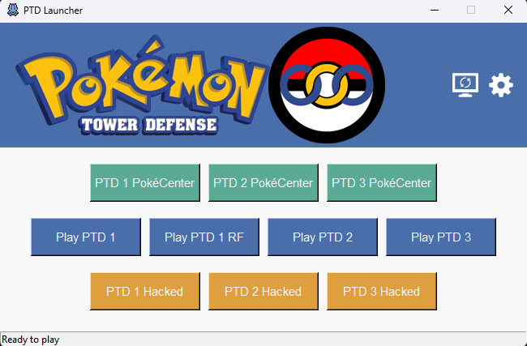

# PTD Launcher

<p align="center">
  
</p>

## Overview
PTD Launcher is a desktop application that allows you to play **Pokemon Tower Defense (PTD)** games using Flash Player. This launcher provides an easy way to access different versions of PTD games, including the original games and hacked versions.

## Features
- Play multiple **Pokemon Tower Defense** games:
  - PTD 1, PTD 2, and PTD 3 (original versions)
  - PTD 1 Regional Forms
  - Hacked versions of PTD 1, PTD 2, and PTD 3
- **Built-in Flash Player management**:
  - Automatic download and updates of Flash Player
  - Support for custom Flash Player executables
- **Direct access to PTD PokéCenter websites**
- **Automatic game updates**
- **Sound effects**
- **User-friendly interface**

## Installation

### Requirements
- Windows, Linux (Ubuntu-based), macOS operating system
- Internet connection for updates and downloading game files

### Setup
1. Download the latest release from the **Releases** page.
2. Extract the ZIP file to a location of your choice.
3. Run `PTDLauncher` to start the application.

## Usage

<p align="center">
  
</p>

### Running on Linux
To make Flash Player work and be able to run games on Linux, execute the following commands:

First:
```bash
sudo apt update
```
Then:
```bash
sudo apt install libgtk2.0-0
```

### Playing Games
- Click on any of the game buttons to launch the corresponding game.
- The launcher will automatically download any required files.

### Settings
- Click the **settings** icon in the top-right corner to access settings.
- You can enable/disable sound effects.
- You can select a custom Flash Player executable.

### Updates
- Click the **update** icon in the top-right corner to check for updates.
- The launcher will automatically download the latest versions of games and Flash Player.

## Building from Source

1. Clone the repository:
   ```bash
   git clone https://github.com/your-repo/PTD-Launcher.git
   ```
2. Install the required dependencies:
   ```bash
   pip install pygame requests
   ```
3. Run the application:
   ```bash
   python PTDLauncher.py
   ```

## License
This project is licensed under the **GNU General Public License v3.0 (GPL-3.0).**

## Credits
This project is forked from [PTD-Launcher](https://github.com/tivp/PTD-Launcher).
